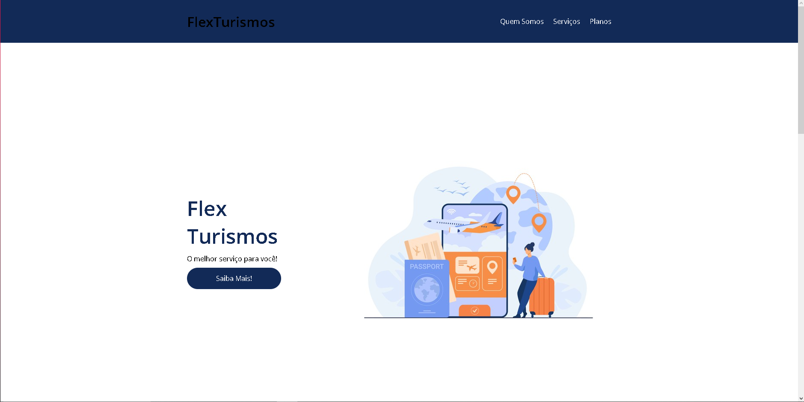
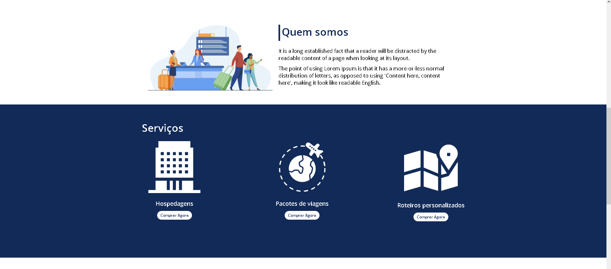
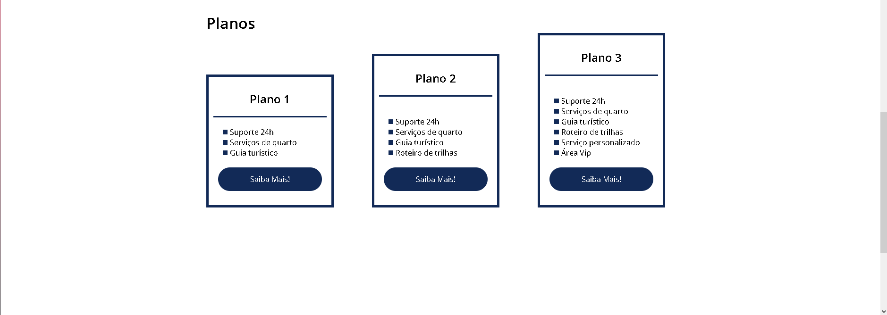
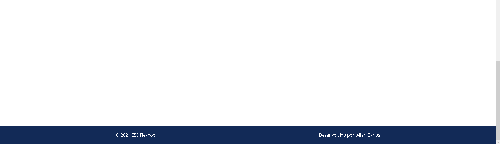

# Project Flexbox DIO 👨‍🎓

Projeto desenvolvido durante o curso de *Flexbox* da DIO que está disponível no Bootcamp **Impulso Javascript Evolution** para aprender como se desenvolve uma página utilizando os conceitos de *Flexbox* vistos em aula para alinhar a página e deixá-la mais responsiva.

## Imagens da página 🖼️

É isso! 😃
